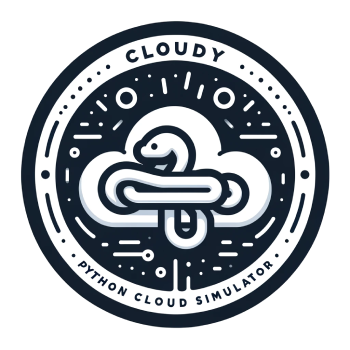

# Cloudy: a modern simulator of cloud environments

[](https://opensource.org/licenses/GPL-3.0)
[](https://github.com/ahmad-siavashi/cloudy)
[](https://github.com/ahmad-siavashi/cloudy/tree/main/docs)

[](https://github.com/ahmad-siavashi/cloudy)



Cloudy is a framework designed for modeling and simulating cloud computing environments and services. It
provides the necessary components that researchers and studies require to investigate new concepts and expedite the
development and evaluation process in the evolving field of cloud computing. The choice of Python as the programming
language for Cloudy is for its user-friendly nature and efficient compatibility with third-party libraries. This
decision addresses certain limitations found in other simulators. The simulator is built to be flexible,
capable of supporting a variety of cloud-based services to meet the diverse requirements of researchers.

## Getting started

The simulator is designed to be easy to use and extend. To run Cloudy,

1. Clone the project

    ```bash 
    $ git clone https://github.com/ahmad-siavashi/cloudy.git 
    ```

2. Install [Python 3.10](https://wiki.python.org/moin/BeginnersGuide/Download)

3. Install dependencies
     ```bash
     $ pip install -r requirements.txt
     ```

4. Set up `PYTHONPATH` environment variable
    - Determine the path to your project source root directory (where `cloudy/src` is located).
   #### Windows PowerShell
     ```powershell
     $env:PYTHONPATH = "<path_to_project_root>;$env:PYTHONPATH"
     ```

   #### Windows Command Prompt (CMD)
     ```batch
     set PYTHONPATH=<path_to_project_root>;%PYTHONPATH%
     ```
   #### Linux (Bash)
     ```bash
     export PYTHONPATH=<path_to_project_root>:$PYTHONPATH
     ```

   **Note:** _Depending on your operating system and shell environment, you may need to replace backslashes with double
   backslashes when setting the `PYTHONPATH` variable on Windows. For example, if the path to your project root
   directory is `C:\path\to\cloudy\src`, you should set the `PYTHONPATH` variable as `C:\\path\\to\\cloudy\\src"` in
   Windows environments. This is due to the way backslashes are treated as escape characters in certain contexts. Linux
   environments do not require this adjustment._

5. Run an example
      ```bash
      $ python3 basic_example.py
      ```

That's all. The code is minimal, self-documented and easy to read. You can quickly start coding by reading the existing
code and example. Nevertheless, documentations are provided in the `docs` directory.

## Examples

Explore the capabilities of Cloudy by checking out the examples in the `examples` directory. These examples demonstrate
some use cases and functionalities of the simulator.

## Development

The simulator is a work in progress. Please feel free to develop new features or make improvements. You can contact me
through [email](mailto:siavashi@aut.ac.ir). For ensuring the reliability of the codebase, limited unit tests are
available in
the `tests` directory. You are encouraged to add more tests as you contribute to the project.

**Generating HTML Documentation with PyDoctor**

To regenerate HTML documentation for the Python code using PyDoctor, run the following command in the terminal or
command prompt while you are within the project root directory, i.e. cloudy:

```bash
$ pip install pydoctor
$ pydoctor --project-name cloudy --html-output ./docs/ --docformat=numpy ./src/model/ ./src/module/ ./src/policy/
```

PyDoctor will analyze the code and generate the HTML documentation, which can be accessed in the
specified `doc` directory. The docstrings are written
with [numpy style](https://numpydoc.readthedocs.io/en/latest/format.html).

**Architecture**

Cloudy works mainly as a discrete-time simulation but also includes some features of
event-driven simulations. It operates by checking and updating the system at regular, set intervals. This is like a
clock ticking at a steady pace. However, Cloudy can also handle new situations or "events" that come up during these
intervals, dealing with them later. This mix of a steady, predictable pattern with the ability to react to unexpected
events makes Cloudy versatile. It's especially useful for simulations that need regular updates but also must adapt to
sudden changes.

The simulator is built in a way that's easy to understand, using Python libraries. It uses two main
libraries: [evque](https://github.com/ahmad-siavashi/evque) and [cloca](https://github.com/ahmad-siavashi/cloca). Cloca
acts like a master clock, keeping everything in the simulation in sync. Evque is used for communication within the
simulation, allowing different parts to exchange information without directly knowing each other. This setup makes
Cloudy flexible and scalable, suitable for complex tasks.

### Topics

Here is an explanation of the main events used in the Cloudy simulator, along with a short explanation of what they mean
and when they are used:

- **request.arrive**: This event happens when a request comes in. It counts and records these requests in the simulator.

- **request.accept**: This happens when a request is approved, and the approval is noted down.

- **request.reject**: This occurs when a request is turned down, and the rejection is recorded.

- **request.stop**: This event is for when a request is finished or stopped, and this is also noted in the records.

- **action.execute**: This deals with carrying out a series of actions. What exactly happens depends on the specific
  instructions given.

- **app.start**: This marks the beginning of an application running on a VM.

- **app.stop**: This is when an application on a VM is stopped.

- **container.start**: This is for starting a container on a VM.

- **container.stop**: This is for stopping a container on a VM.

- **controller.start**: This indicates the start of a controller on a VM.

- **controller.stop**: This is when a controller on a VM is stopped.

- **deployment.run**: This shows when a deployment is actively running.

- **deployment.pend**: This means a deployment is waiting for resources.

- **deployment.degrade**: This indicates a deployment is not running optimally with some replicas still pending.

- **deployment.scale**: This is when the size of a deployment is changed, either by adding or removing replicas.

- **deployment.stop**: This is when a deployment is completely stopped.

- **vm.allocate**: This happens when a VM is assigned to a physical machine (PM).

- **vm.deallocate**: This is when a VM is removed or released from a PM.

- **sim.log**: This is for the general logging mechanism of the simulation.

The system for handling these events is made to be flexible, so developers can add new things or change it to suit their
needs.